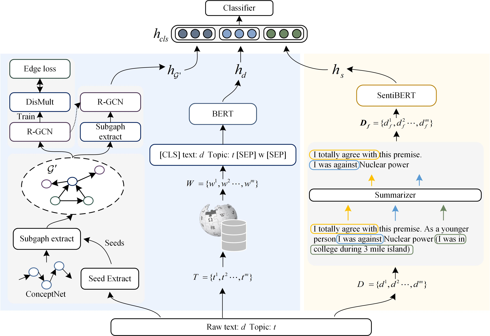

# This is the source code of IJCNN 2024 paper SentKB-BERT: Sentiment-filtered Knowledge-based Stance Detection

# Get Start
To run the code in this repo, you need to have following dependencies:
```
python==3.9.6
pytorch==1.12.1
transformers==4.32.1
torch-scatter==2.0.9
pytorch-geometric==2.3.1
spacy==3.5.3
requests==2.27.1
responses==0.13.3
tqdm==4.65.0
gensim==4.3.0
networkx==3.1
```

# Data Preparing
## dataset
We evaluated the proposed model on [VAST](https://github.com/emilyallaway/zero-shot-stance), which is included in `data/VAST` of this repo.
## Commonsense Graph
The [ConceptNet](https://drive.google.com/file/d/19klcp69OYEf29A_JrBphgkMVPQ9rXe1k/view) must be downloaded separately and placed in `data/` with VAST.
## Wiki text
Following [WS-BERT](https://github.com/zihaohe123/wiki-enhanced-stance-detection), we collected topic-related data and store them into `data/VAST/wiki-vast.csv` and `data/VAST/wiki_dict.pkl`.
## Text Summarization
The summarized text are indluded in `data/VAST` of this repo. You can also choose other summarization model to regenerate the summarization.

# Graph Encoding
Before training the stance detection model, we first train a graph encoder following [BS-RGCN](https://github.com/LuoXiaoHeics/StanceCS):

``` shell
python src/preprocess_graph.py
python src/train_and_extract_graph_features.py
python src/extract_graph_features.py
```

# Stance Detection
```shell
python run_vast.py
```

# Cite
```

```